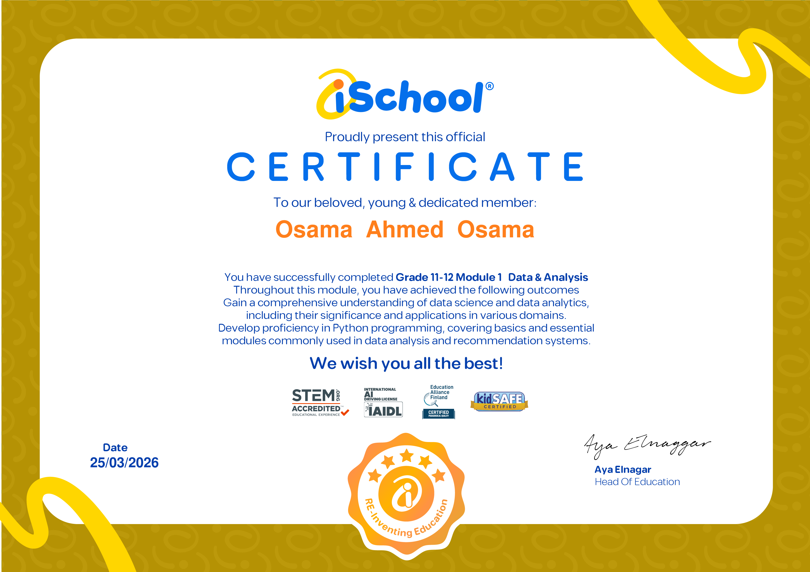
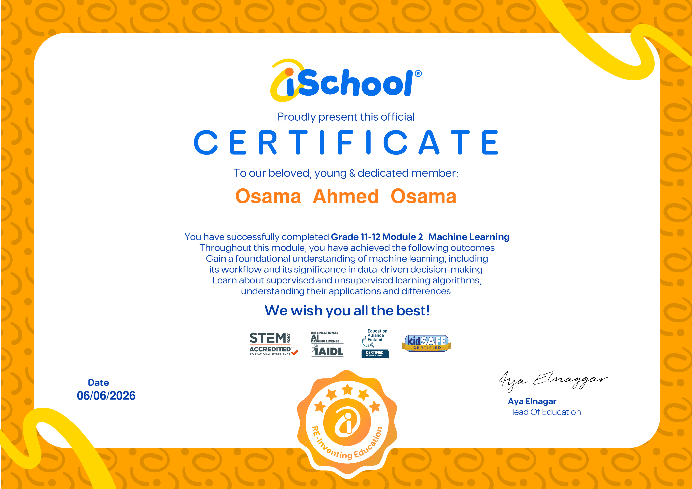
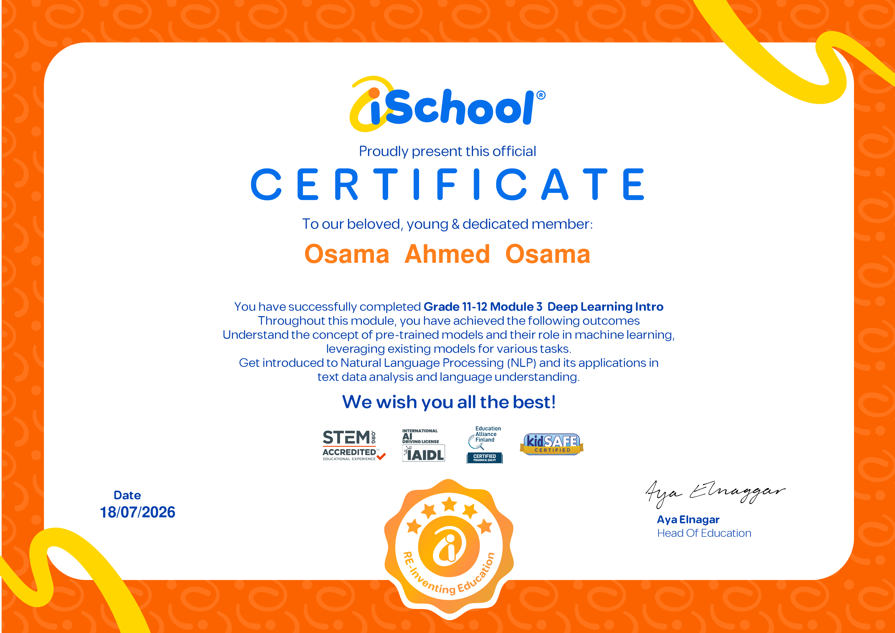
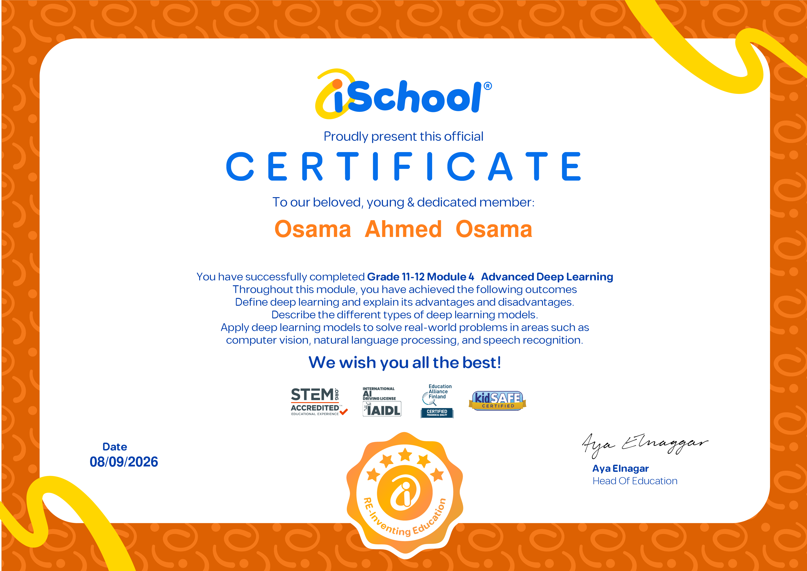

# 🎓 Certificates

iSchool — Grade 11-12 Data Science & AI track. STEM.org accredited.

## Osama Ahmed Osama

| Module | Topic | Date |
| --- | --- | --- |
| [Module 1](module1-data-analysis.png) | Data & Analysis — data science & analytics fundamentals, Python basics | 25/03/2026 |
| [Module 2](module2-machine-learning.png) | Machine Learning — ML workflow, supervised & unsupervised learning | 06/06/2026 |
| [Module 3](module3-deep-learning-intro.png) | Deep Learning Intro — pre-trained models, intro to NLP | 18/07/2026 |
| [Module 4](module4-advanced-deep-learning.png) | Advanced Deep Learning — deep learning model types, computer vision, NLP, speech recognition | 08/09/2026 |

---

### Module 1 — Data & Analysis

### Module 2 — Machine Learning

### Module 3 — Deep Learning Intro

### Module 4 — Advanced Deep Learning

